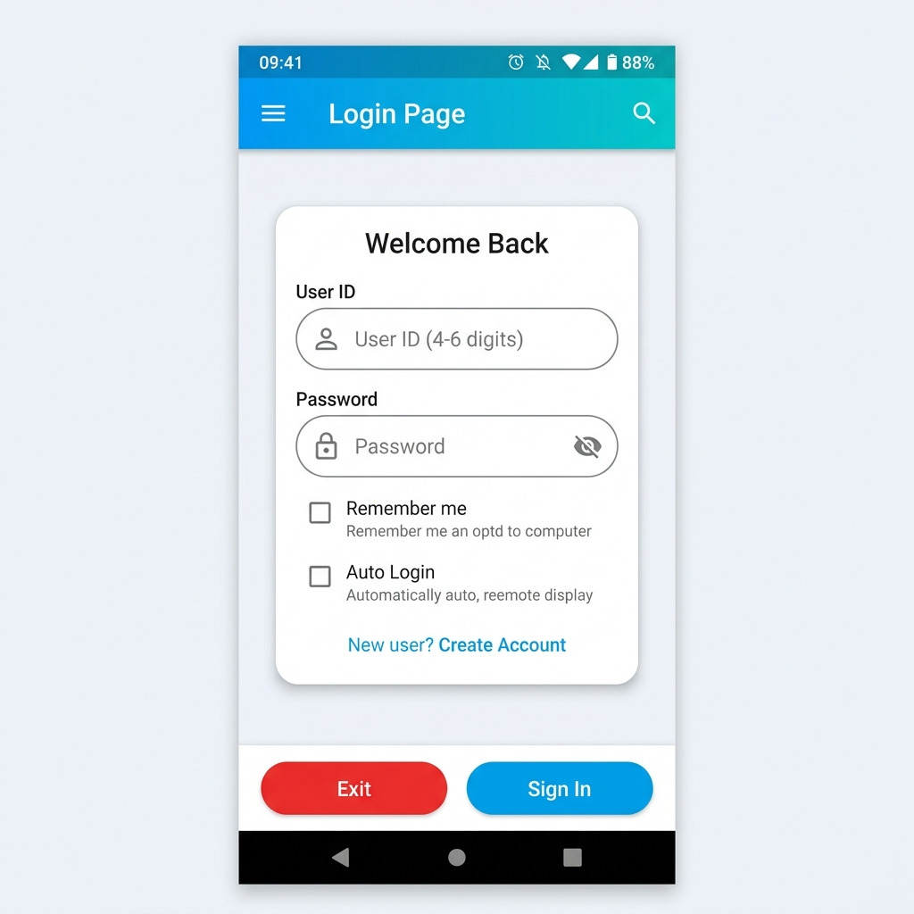
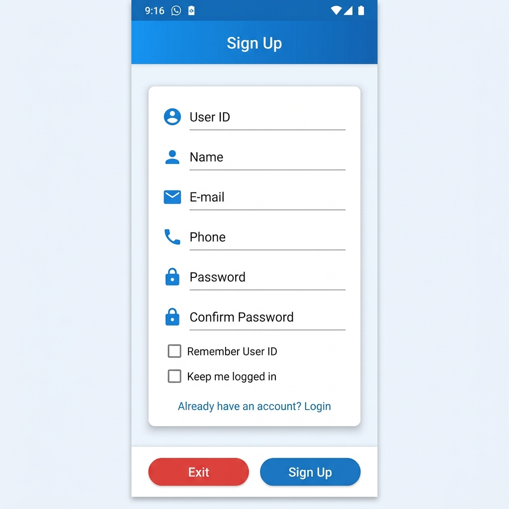
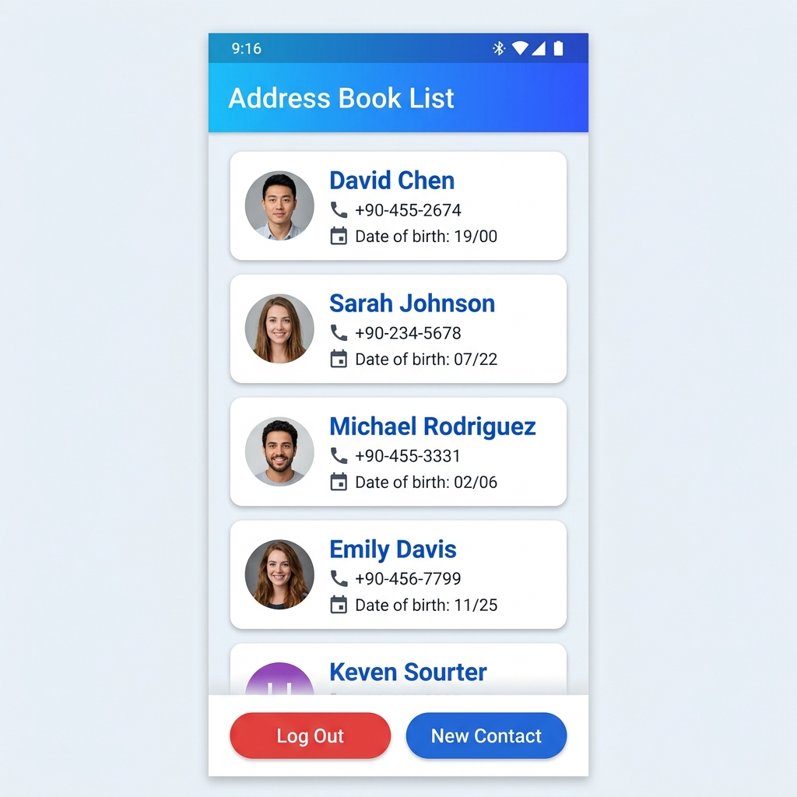
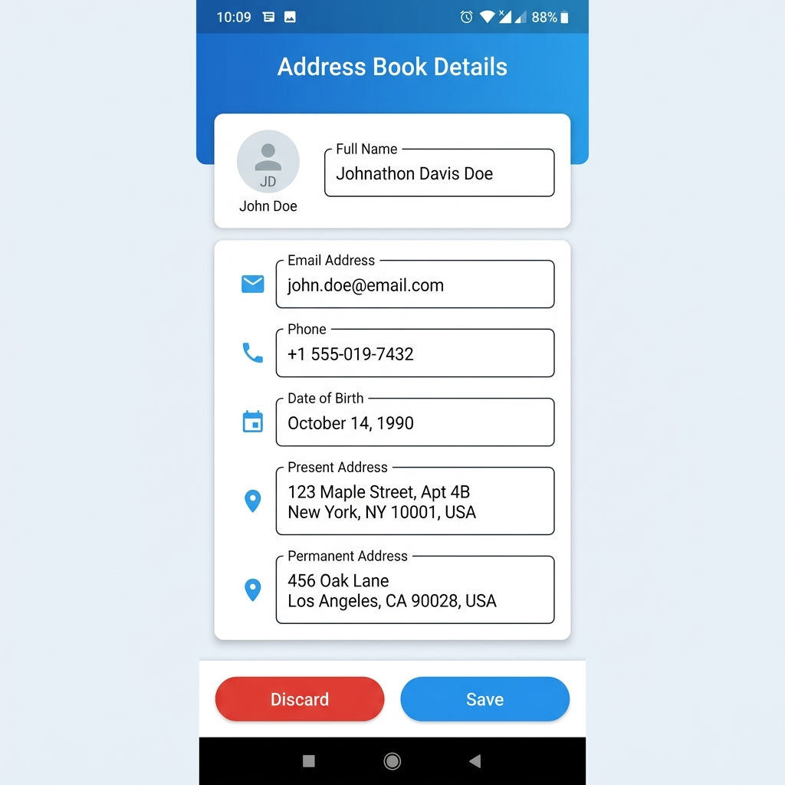

# 📱 Address Book Android App

[](https://developer.android.com/)
[](https://www.java.com/)
[](https://www.sqlite.org/)
[](https://gradle.org/)

A full-featured, modern Android application developed for **CSE489 (Mobile Application Development)** at **East West University**. The application provides user authentication (Sign Up / Sign In with session management) and complete contact management features backed by a local SQLite database (`EventDB`).

---

## 📸 Screenshots & UI Layout Previews

The application interface is styled with custom gradients, elevated card surfaces, rounded action buttons, and responsive XML table/linear layouts.

| 🔑 Login Screen | 📝 Sign Up Screen |
| :---: | :---: |
|  |  |
| *`activity_login_page.xml`* | *`activity_sign_up.xml`* |

| 📇 Address Book List | ✏️ Contact Details Form |
| :---: | :---: |
|  |  |
| *`activity_address_book.xml`* | *`activity_address_details.xml`* |

---

## ✨ Features

- 🔒 **User Authentication & Session Management**:
  - Sign up with User ID validation (4–6 digits), Name, Email, Phone number, and Password (min 6 characters).
  - Login with credential verification.
  - Options for **"Remember me"** (persists User ID) and **"Auto Login"** (persists login session via `SharedPreferences`).
- 📖 **Address Book Management**:
  - Dynamic `ListView` rendering saved contacts using a custom `ActivityAdapter`.
  - Click on any contact item to view or update contact details.
  - Long-press on any contact item to open a confirmation `AlertDialog` for deletion.
- 🖼️ **Profile Picture Selection**:
  - Image picker integrated into the contact form using `ActivityResultLauncher` (`GetContent()`).
- 💾 **SQLite Data Persistence (`EventDB`)**:
  - Fully local CRUD operations (Create, Read, Update, Delete) with SQLite database transactions.

---

## 🎨 XML Layout Architecture

The application UI is constructed across 5 primary XML layouts:

1. **[`activity_login_page.xml`](app/src/main/res/layout/activity_login_page.xml)**:
   - Modern gradient top title banner (`gradient_blue`).
   - Card layout with input rows for User ID and Password, equipped with icons (`ic_person`, `ic_lock`).
   - Checkboxes for `Remember me` and `Auto Login`.
   - Bottom bar with rounded action buttons (**Exit** in red, **Sign In** in blue).

2. **[`activity_sign_up.xml`](app/src/main/res/layout/activity_sign_up.xml)**:
   - Scrollable card container with fields for User ID, Full Name, E-mail, Phone, Password, and Confirm Password.
   - Interactive navigation back to Login page for existing users.

3. **[`activity_address_book.xml`](app/src/main/res/layout/activity_address_book.xml)**:
   - Header title banner and framed container wrapping the main `ListView`.
   - Action toolbar at the bottom for **Log Out** and **New Contact**.

4. **[`activity_address_details.xml`](app/src/main/res/layout/activity_address_details.xml)**:
   - Comprehensive contact entry form with full name input, profile picture avatar box, email, phone, date of birth, present address, and permanent address.
   - Dual action buttons: **Discard** and **Save**.

5. **[`row_contact.xml`](app/src/main/res/layout/row_contact.xml)**:
   - Template row for list rendering: displays contact profile icon, bold contact name, phone number, and DOB with inline icons.

---

## 📂 Project Structure

```
Lab22023360051/
├── app/
│   ├── src/
│   │   └── main/
│   │       ├── java/com/example/lab22023_3_60_051/
│   │       │   ├── ActivityAdapter.java        # Custom ArrayAdapter for contact ListView
│   │       │   ├── AddressBook_Activity.java   # Main list activity (CRUD, long-press delete)
│   │       │   ├── AddressDetails_Activity.java# Add/Edit contact activity & image picker
│   │       │   ├── Contact.java                # Data model class for Contact
│   │       │   ├── EventDB.java                # SQLite OpenHelper (Database helper)
│   │       │   ├── LoginPage_Activity.java     # Authentication activity (Login)
│   │       │   └── SignUp_Activity.java        # User Registration activity
│   │       ├── res/
│   │       │   ├── drawable/                   # Gradient backgrounds, rounded edittexts, icons
│   │       │   ├── layout/
│   │       │   │   ├── activity_address_book.xml
│   │       │   │   ├── activity_address_details.xml
│   │       │   │   ├── activity_login_page.xml
│   │       │   │   ├── activity_sign_up.xml
│   │       │   │   └── row_contact.xml
│   │       │   └── values/
│   │       │       ├── colors.xml
│   │       │       ├── strings.xml
│   │       │       └── themes.xml
│   │       └── AndroidManifest.xml
├── docs/
│   └── screenshots/                            # App UI screenshots
│       ├── login_screen.png
│       ├── signup_screen.png
│       ├── address_book_screen.png
│       └── address_details_screen.png
├── build.gradle.kts
└── settings.gradle.kts
```

---

## 🗄️ Database Schema (`EventDB.db`)

Table Name: `contacts`

| Column | Data Type | Constraint | Description |
| :--- | :--- | :--- | :--- |
| `email` | `TEXT` | `PRIMARY KEY` | Contact's unique email address |
| `name` | `TEXT` | - | Contact's full name |
| `phone` | `TEXT` | - | Contact's phone number |
| `dob` | `TEXT` | - | Contact's Date of Birth (DD/MM/YYYY) |
| `present_address` | `TEXT` | - | Contact's current address |
| `permanent_address` | `TEXT` | - | Contact's permanent address |
| `image_uri` | `TEXT` | - | Local URI of selected profile photo |

---

## 🛠️ How to Build and Run

1. **Clone or Open Project**:
   Open Android Studio and select **Open** -> Navigate to the root directory `Lab22023360051`.

2. **Gradle Sync**:
   Allow Android Studio to download dependencies and sync Gradle automatically.

3. **Run on Device / Emulator**:
   - Connect an Android device with USB Debugging enabled or start an Android Virtual Device (AVD).
   - Select `app` run configuration and click **Run (Shift + F10)**.

4. **Command Line Build**:
   ```bash
   # Build Debug APK
   ./gradlew assembleDebug
   ```

---

## 🎓 Academic Info

- **Course**: CSE489 - Mobile Application Development
- **Institution**: East West University (EWU)
- **Lab Assignment**: Lab 2
- **Student ID**: 2023-3-60-051
